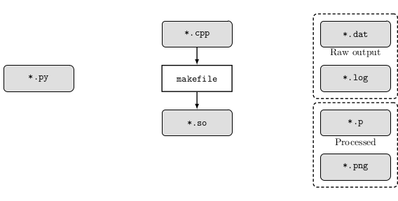

# hpr-sim

`High Power Rocketry - Flight Simulation`


## Overview

The goal of this project is to build a robust, extensible flight simulation package for high power rocketry, with open-source dependencies. Key features considered to constitute a "robust" simulation include:

 - 6-DOF kinematic model
 - Built-in Monte Carlo functionality
 - Multithreading to support " " 
 - Standard atmospheric modeling
 - Stochastic wind turbulence model
 - Comptability w/ RASP (`*.eng`) engine files (http://www.thrustcurve.org/raspformat.shtml)
 - Flight data visualization & plain-text export

The intent is to lean on the respective strengths of python and C++ to build a modern, efficient simulation package. Python is to be used for pre-processing, post-processing, and data visualization, while C++ will constitue the bulk of the numerical routines. A python-C++ binding library will be used to interface between the two sets of source code. 

Future work may include a user interface using PyQt5.

Other (more professional) projects with a similar scope & application are OpenRocket and RASAero II. 

See `./doc/MANUAL.md` for program installation \& execution.



## Directory Index

- `./bin/` - All binary object(s)
- `./build/` - Makefile & build config
- `./doc/` - Supporting documentation
- `./input/` - Simulation input
- `./output/` - Simulation output
- `./src/` - Python & C++ source
- `./tools/` - Project utilities


```
.
├── bin
│   └── input.cpython-37m-x86_64-linux-gnu.so
├── build
│   └── makefile
├── doc
│   ├── figs
│   └── MANUAL.md
├── input
│   └── placeholder
├── output
│   └── placeholder
├── src
│   ├── models
│   ├── solvers
│   ├── utilities
│   ├── example.cpp
│   ├── input.cpp
│   ├── input.h
│   ├── load_data.py
│   └── load_input.py
├── tools
│   └── update_index.sh
├── LICENSE
└── README.md

11 directories, 13 files
```
