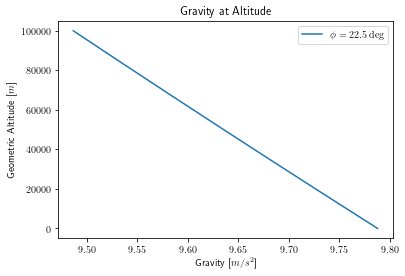
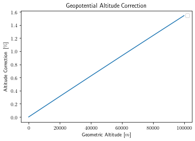
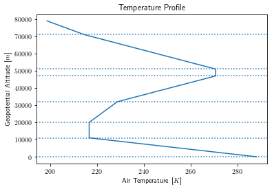
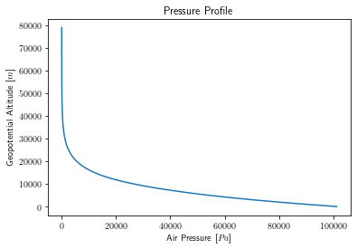

# Algorithms

## Geodetic Model

| Input(s) |                            | Units | | Output(s)  |                             | Units |
|----------|----------------------------|-------|-|------------|-----------------------------|-------|
| $\phi$   | Launch site latitude       | $rad$ | | $\gamma$   | Gravity at sea level        | $m$   |
| $h$      | Launch site altitude (MSL) | $m$   | | $\gamma_h$ | Gravity at altitude         | $m$   |
|          |                            |       | | $h_{GP}$   | Geopotential altitude (MSL) | $m$   |

To determine the local gravitational acceleration, the WGS84 geodetic model is used from `NGA.STND.0036_1.0.0_WGS84` (2014-07-08) [^wgs84].

 From launch site latitude $\phi$, the normal gravity $\gamma$ is found on the ellipsoidal surface (Somigliana's formula):

$$
    \gamma = \gamma_e \cdot \frac{1 + k \sin^2 \phi}{\sqrt{1 - e^2 \sin^2 \phi}}
$$

Then, $\gamma$ is used to find normal gravity $\gamma_h$ at a height $h$ above the ellipsoid:

$$
    \gamma_h = \gamma \cdot \bigg[ 1 - \frac{2}{a} \left( 1 + f + m - 2f \sin^2 \phi \right) h + \frac{3}{a^2} h^2 \bigg]
$$

The local geocentric radius of earth is found using the geometry of the ellipsoid:

$$
    r_e = \sqrt{\frac{(a^2 \cos\phi)^2 + (b^2\sin\phi)^2}{(a\cos\phi)^2 + (b\sin\phi)^2}}
$$

This allows the geopotential altitude to be determined:

$$
    h_{GP} = \frac{r_e \cdot h}{r_e + h}
$$

The difference between geometric and geopotential altitude is nonzero, but does not become significant until high altitudes;
for example, at a geometric altitude of 65 km the geopotential altitude is ~1% less.

| Constant(s) |                                                               | Value               | Units           |
|-------------|---------------------------------------------------------------|---------------------|-----------------|
| $\gamma_e$  | Normal gravity at the equator (on the ellispoid)              | 9.7803253359        | $\frac{m}{s^2}$ |
| $k$         | Somigliana’s Formula - normal gravity formula constant        | 1.931852652458e-3   | -               |
| $e$         | First eccentricity of the ellispoid                           | 8.1819190842622e-2  | -               |
| $a$         | Semi-major axis of the ellipsoid                              | 6378137.0           | $m$             |
| $b$         | Semi-minor axis of the ellipsoid                              | 6356752.3142        | $m$             |
| $f$         | WGS 84 flattening (reduced)                                   | 3.3528106647475e-03 | -               |
| $m$         | Normal gravity formula constant ($\frac{\omega^2 a^2 b}{GM}$) | 3.449786506841e-3   | -               |

## Atmosphere Model

US Standard Atmosphere 1976 [^us1976]

The temperature lapse rate is given across several zones:

The pressure profile for an isothermal region ($a = 0$) is: [^anderson_intro_to_flight]

$$
    p = p_1 \cdot e^{-(g_0/RT)(h-h_1)}
$$

While the pressure profile for a gradient region ($a \neq 0$) is found by: [^anderson_intro_to_flight]

$$
    p = p_1 \cdot \left( \frac{T}{T_1} \right)^{-g_0/aR}
$$

With temperature and pressure known, the density at altitude is simply found from the equation of state for a perfect gas:

$$
    p = \rho R T
    \quad\Rightarrow\quad
    \rho = \frac{p}{RT}
$$

Sutherland's Law [^sutherland] is used to determine the dynamic viscosity of air $\mu$ at a temperature $T$:

$$
    \mu = \mu_{0} \left( \frac{T}{T_{0}} \right)^{3/2} \frac{T_{0} + S}{T + S}
$$

| Symbol  | Quantity                  | Value    | Unit                                |
|---------|---------------------------|----------|-------------------------------------|
| $T_0$   | Reference temperature     | 273.15   | [$K$]                               |
| $\mu_0$ | Viscosity of air at $T_0$ | 1.716e-5 | $\left[\frac{kg}{m \cdot s}\right]$ |
| S       | Sutherland constant       | 110.4    | [$K$]                               |

## References

[^wgs84]: <https://earth-info.nga.mil/php/download.php?file=coord-wgs84>
[^us1976]: <https://www.ngdc.noaa.gov/stp/space-weather/online-publications/miscellaneous/us-standard-atmosphere-1976/us-standard-atmosphere_st76-1562_noaa.pdf>
[^anderson_intro_to_flight]: Anderson, J. D. (1989). Chapter 3 The Standard Atmosphere. In *Introduction to Flight* (3rd ed., pp. 74–77). McGraw-Hill.
[^sutherland]: <https://www.cfd-online.com/Wiki/Sutherland%27s_law>