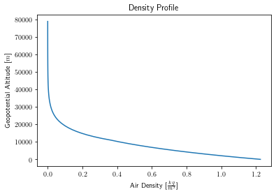
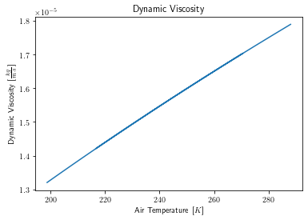

# Algorithms

## Geodetic Model

| Input(s)  |                          | Units | | Output(s)  |                             | Units |
|-----------|--------------------------|-------|-|------------|-----------------------------|-------|
| $\phi$    | Launch site latitude     | $rad$ | | $\gamma$   | Gravity at sea level        | $m$   |
| $h_{G}$   | Geometric altitude (MSL) | $m$   | | $\gamma_h$ | Gravity at altitude         | $m$   |
|           |                          |       | | $h$        | Geopotential altitude (MSL) | $m$   |

To determine the local gravitational acceleration, the WGS 84 geodetic model is used from `NGA.STND.0036_1.0.0_WGS84` (2014-07-08) [^wgs84].

From launch site latitude $\phi$, the normal gravity $\gamma$ is found on the ellipsoidal surface (Somigliana's formula): [^wgs84] (pp. 4-1)

$$
    \gamma = \gamma_e \cdot \frac{1 + k \sin^2 \phi}{\sqrt{1 - e^2 \sin^2 \phi}}
$$

Then, $\gamma$ is used to find normal gravity $\gamma_h$ at a geometric height $h_G$ above the ellipsoid: [^wgs84] (pp. 4-3)

$$
    \gamma_h = \gamma \cdot \bigg[ 1 - \frac{2}{a} \left( 1 + f + m - 2f \sin^2 \phi \right) h_G + \frac{3}{a^2} h_G^2 \bigg]
$$

The local geocentric radius of earth is found using the geometry of the ellipsoid: [^wikipedia_geocentric_radius]

$$
    r_e = \sqrt{\frac{(a^2 \cos\phi)^2 + (b^2\sin\phi)^2}{(a\cos\phi)^2 + (b\sin\phi)^2}}
$$

This allows the geopotential altitude to be determined: [^us1976] (pp. 8)

$$
    h = \frac{r_e \cdot h_G}{r_e + h_G}
$$

The difference between geometric and geopotential altitude is nonzero, but does not become significant until high altitudes;
for example, at a geometric altitude of 65 km the geopotential altitude is ~1% less.

| Constant(s) |                                                               | Value               | Units           |
|-------------|---------------------------------------------------------------|---------------------|-----------------|
| $\gamma_e$  | Normal gravity at the equator (on the ellispoid)              | 9.7803253359        | $\frac{m}{s^2}$ |
| $k$         | Somigliana’s Formula - normal gravity formula constant        | 1.931852652458e-3   | -               |
| $e$         | First eccentricity of the ellispoid                           | 8.1819190842622e-2  | -               |
| $a$         | Semi-major axis of the ellipsoid                              | 6378137.0           | $m$             |
| $b$         | Semi-minor axis of the ellipsoid                              | 6356752.3142        | $m$             |
| $f$         | WGS 84 flattening (reduced)                                   | 3.3528106647475e-03 | -               |
| $m$         | Normal gravity formula constant ($\frac{\omega^2 a^2 b}{GM}$) | 3.449786506841e-3   | -               |

## Atmosphere Model

| Input(s) |                                 | Units           | | Output(s) |                   | Units                  |
|----------|---------------------------------|-----------------|-|-----------|-------------------|------------------------|
| $h$      | Geopotential altitude (MSL)     | $m$             | | $T$       | Temperature       | $K$                    |
| $g_0$    | Gravity at sea level            | $\frac{m}{s^2}$ | | $p$       | Pressure          | $Pa$                   |
| $T_0$    | Launch site ambient temperature | $K$             | | $\rho$    | Density           | $\frac{kg}{m^3}$       |
| $p_0$    | Launch site ambient pressure    | $Pa$            | | $a$       | Speed of sound    | $\frac{m}{s}$          |
|          |                                 |                 | | $\mu$     | Dynamic viscosity | $\frac{kg}{m \cdot s}$ |

The US Standard Atmosphere 1976 [^us1976] is used to determine the atmospheric quantities at a given altitude.

The temperature gradient (also known as "lapse rate") is given across several altitude regions: [^us1976] (pp. 3)

| Geopotential Altitude [$km$] | Temperature Gradient [$\frac{K}{km}$] |
|------------------------------|---------------------------------------|
| 0                            | -6.5                                  |
| 11                           |  0.0                                  |
| 20                           | +1.0                                  |
| 32                           | +2.8                                  |
| 47                           |  0.0                                  |
| 51                           | -2.8                                  |
| 71                           | -2.0                                  |
| 84.8520                      | n/a                                   |

The ambient temperature at a given altitude can be found with a simple linear relationship: [^us1976] (pp. 10)

$$
    T = T_1 + \frac{dT}{dh} (h - h_1)
$$

where $T_1$ is the temperature at the previous region boundary. 

The pressure profile for an isothermal region ($\frac{dT}{dh} = 0$) is: [^anderson_intro_to_flight] (pp. 75)

$$
    p = p_1 \cdot e^{-(g_0/RT)(h-h_1)}
$$

While the pressure profile for a gradient region ($\frac{dT}{dh} \neq 0$) is found by: [^anderson_intro_to_flight] (pp. 76)

$$
    p = p_1 \cdot \left( \frac{T}{T_1} \right)^{-g_0/(\frac{dT}{dh}R)}
$$

Again, where $p_1$ is the pressure at the previous region boundary. To initialize this model, an initial temperature $T_0$ and pressure $p_0$ at ground level is propagated upwards to generate the values at each boundary.

With temperature and pressure known, the density at altitude is simply found from the equation of state for a perfect gas: [^anderson_intro_to_flight] (pp. 58)

$$
    p = \rho R T
    \quad\Rightarrow\quad
    \rho = \frac{p}{RT}
$$

The speed of sound $a$ is given as a function of temperature: [^anderson_intro_to_flight] (pp. 107)

$$
    a = \sqrt{\gamma \cdot R \cdot T}
$$

Finally, Sutherland's Law [^sutherland] is used to determine the dynamic viscosity of air $\mu$:

$$
    \mu = \mu_{ref} \left( \frac{T}{T_{ref}} \right)^{3/2} \frac{T_{ref} + S}{T + S}
$$

| Constant(s) |                               | Value    | Units                               |
|-------------|-------------------------------|----------|-------------------------------------|
| $R$         | Specific gas constant of air  | 287.053  | [$\frac{J}{kg \cdot K}$]            |
| $\gamma$    | Specific heat ratio of air    | 1.40     | -                                   |
| $T_{ref}$   | Reference temperature         | 273.15   | [$K$]                               |
| $\mu_{ref}$ | Viscosity of air at $T_{ref}$ | 1.716e-5 | [$\frac{kg}{m \cdot s}$]            |
| S           | Sutherland constant           | 110.4    | [$K$]                               |

## References

[^wgs84]: National Geospatial-Intelligence Agency (NGA). (2014). *Department of Defense World Geodetic System 1984*. <https://earth-info.nga.mil/php/download.php?file=coord-wgs84>

[^wikipedia_geocentric_radius]: Geocentric radius. (2022, February 10). In *Wikipedia*. <https://en.wikipedia.org/wiki/Earth_radius#Geocentric_radius>

[^us1976]: National Oceanic & Atmospheric Administration (NOAA). (1976). *U.S. Standard Atmosphere, 1976*. <https://www.ngdc.noaa.gov/stp/space-weather/online-publications/miscellaneous/us-standard-atmosphere-1976/us-standard-atmosphere_st76-1562_noaa.pdf>

[^anderson_intro_to_flight]: Anderson, J. D. (1989). *Introduction to Flight* (3rd ed.). McGraw-Hill.

[^sutherland]: *Sutherland's law*. (2008, October 25). CFD Online. Retrieved February 10, 2022, from <https://www.cfd-online.com/Wiki/Sutherland%27s_law>